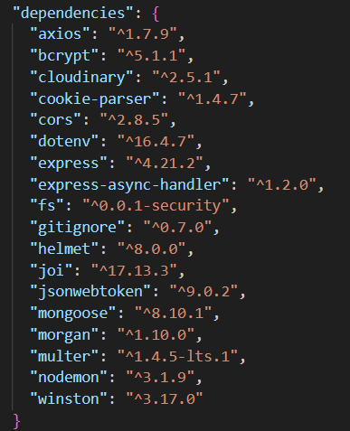

# Back-end

## Introduction

Voici le back-end d'un portfolio développée avec Node.js et MongoDB.
Il permet de gérer les utilisateurs, leurs compétences et leurs paramètres.

## Prérequis

- Node.js installé
- npm (gestionnaire de paquets)
- MongoDb (Une base de données configurée)
- Cloudinary (Avoir un compte pour récuperer l'API)

## Dépendance installé



## Installation

1. Allez dans le dossier backend si ce n'est pas déjà fait :

```
cd backend
```

2. Installez les dépendances :

```
npm install
```

3. Créez puis configurez le fichier .env :

```
PORT = 5000
MONGO_URI = <votre URI de connexion MongoDB>
CLOUD_NAME = <votre nom de compte Cloudinary>
API_KEY = <votre clé API Cloudinary>
API_SECRET = <votre clé secrète API Cloudinary>
JWT_SECRET = <votre clé secrète pour JWT>
RECAPTCHA_SECRET_KEY = <votre clé secrète reCAPTCHA>
```

4. Lancez le serveur:

```
npm start
```

Pour lancer en mode développement :

```
npm run dev
```

## Utilisation

Pour se connecter en tant que admin :

```
    email : admin@gmail.com,
    password : adminpassword
```

Exemple de requête (dans le terminal) pour se connecter :

```
curl -X POST http://localhost:5000/api/auth/login -H "Content-Type: applicat
ion/json" -d '{"email": "admin@gmail.com", "password": "adminpassword"}'
```

Réponse attendue :

```
{"success":true,
"message":"User logged in successfully",
"user": {
    "_id":"67b89e0eebbbf9d655d648dd",
    "name":"admin",
    "email":"admin@gmail.com",
    "password":"$2b$10$hPCs9CwBH6wTW.yCNRSZeO9SlzYzahs5GURY7RnsB7VugasV/UMtW",
    "role":"admin",
    "skill":["67b89e2debbbf9d655d648e2"],
    "createdAt":"2025-02-21T15:38:54.164Z",
    "updatedAt":"2025-02-21T15:39:25.271Z",
    "__v":0
    }
}
```

## Structure du projet

```
.
├── node_modules                    # Dépendances installées par npm
├── uploads                         # Dossier pour stocker les fichiers téléchargés
├── logs                            # Dossier pour les logs
│   ├── all.log                     # Log principal
|
├── src/
│   ├── config/                     # Configuration des services externes (DB, Cloud, etc.)
│   │   ├── db.js                   # Configuration de la base de données MongoDB
│   │   ├── logger.js               # Configuration du logger (Winston ou autre)
│   ├── controllers/                # Contrôleurs pour gérer la logique métier
│   │   ├── auth.controller.js      # Gestion de l'authentification (inscription, login)
│   │   ├── setting.controller.js   # Logique de gestion des paramètres
│   │   ├── skill.controller.js     # Logique de gestion des compétences
│   ├── middleware/                 # Middlewares pour diverses fonctionnalités
│   │   ├── authMiddleware.js       # Vérifie si l'utilisateur est authentifié
│   │   ├── errorHandler.js         # Gestion des erreurs globales
│   │   ├── morganMiddleware.js     # Logger des requêtes HTTP avec Morgan
│   │   ├── recaptchaMiddleware.js  # Vérifie la validité du reCAPTCHA
│   │   ├── tokenGenerator.js       # Génère un token d'authentification
│   ├── models/                     # Modèles Mongoose représentant les entités de la base de données
│   │   ├── Setting.js              # Modèle pour les paramètres de l'application
│   │   ├── Skills.js               # Modèle pour les compétences
│   │   ├── Users.js                # Modèle pour les utilisateurs
│   ├── routes/                     # Routes pour accéder aux différents services de l'API
│   │   ├── auth.routes.js          # Routes d'authentification (login, register)
│   │   ├── setting.routes.js       # Routes pour la gestion des paramètres
│   │   ├── skill.routes.js         # Routes pour la gestion des compétences
│   ├── validations/                # Fichiers de validation des entrées de l'utilisateur
│   │   ├── authValidation.js       # Validation des données d'authentification
│   │   ├── skillValidation.js      # Validation des données pour les compétences
│   ├── .env                        # Variables d'environnement
│   ├── .gitignore                  # Fichiers à ignorer par git
│   ├── package.json                # Dépendances et configuration du projet
│   ├── README.md                   # Documentation du projet
│   ├── server.js                   # Point d'entrée principal du serveur
```

## API Endpoints

| Méthode    | Endpoint              | Login | Admin | Description                          |
| ---------- | --------------------- | ----- | ----- | ------------------------------------ |
| **GET**    | `/api/auth/`          | ✅    | ✅    | Liste des utilisateurs               |
| **GET**    | `/api/auth/:id`       | ✅    | ❌    | Afficher skill d'un utilisateur      |
| **POST**   | `/api/auth/register`  | ❌    | ❌    | Créer un utilisateur                 |
| **POST**   | `/api/auth/login`     | ❌    | ❌    | Se connecter                         |
| **POST**   | `/api/auth/logout`    | ✅    | ❌    | Se déconnecter                       |
| **DELETE** | `/api/auth/:id`       | ✅    | ✅    | Supprimer un utilisateur             |
| **POST**   | `/api/skill/addSkill` | ✅    | ❌    | Ajouter un skill à l'utilisateur     |
| **PUT**    | `/api/skill/:id`      | ✅    | ❌    | Mettre à jour un skill               |
| **DELETE** | `/api/skill/:id`      | ✅    | ❌    | Supprimer un skill                   |
| **GET**    | `/api/setting/`       | ✅    | ❌    | Liste du setting utilisateur         |
| **POST**   | `/api/setting/theme`  | ✅    | ❌    | Mettre à jour le thème               |
| **POST**   | `/api/setting/skill`  | ✅    | ❌    | Mettre à jour le la forme des skills |

## Sécurité

### Authentification :

Utilisation de JWT pour l'authentification. Un token est généré lors de la connexion et est inclus dans le header `Cookies`.

### Autorisation:

Certaines routes sont réservées aux utilisateurs ou aux administrateurs. Le middleware `authMiddleware.js` vérifie le rôle de l'utilisateur avant d'autoriser l'accès.

## reCAPTCHA :

Intégration de reCAPTCHA pour prévenir les bots.

## Auteur:

Xan Balandrau : [**GitHub**](https://github.com/xanbalandrau/)
